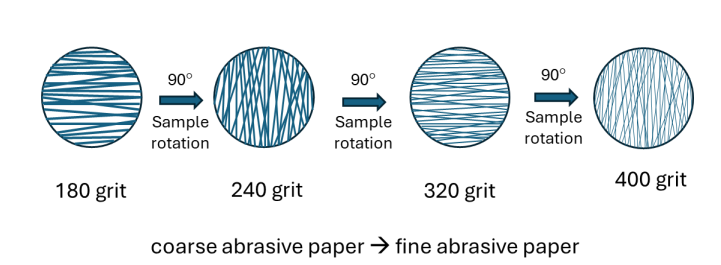

Sample preparation holds a key to optical microscopy, as it represents the material being observed. Accordingly, the structure has to be viewed clearly, and must ensure that the <b>sample being observed is actually the representative</b> of the selected material (as an outcome of its composition, process parameters, thermal treatment, etc). In essence, selection of sample location, followed by sectioning, mounting, grinding, and polishing must not alter the structure of material. If needed, the sample may be etched (wither chemically or thermally) to reveal grain boundary and other phases as needed. Thus, the details not visible to naked eye can be revealed via optical microscopy.  

In order for microscope to be able to image the microstructure, it is important to mirror-polish the sample, and utilize the principle of optics to be able to image features. Appropriate illumination, phase
contrast (or polarization), and magnification optics is utilized for capturing the needful. In some cases, mounting and/or preservation of sample is needed to prevent damage from the environment (i.e. humidity, temperature, etc.) for later observation.  

Biological samples (e.g., tissues, cells) require additional steps of: (i) <b>sample fixation</b> (i.e. to preserves the sample's structure and sterilize it from microorganisms) via thermal/chemical means, and (ii) <b>dehydration</b> to remove water, before these can be prepared for mounting. Bigger biological samples can be directly sectioned and stained for visualization as well (in biological microscope). <b>Mounting</b> processes provide support (required for smaller samples) for handling, followed by sectioning/cutting using a saw/diamond blade for sampling a representative specimen. As the surface gets damaged during sectioning, the process of <b>grinding</b> removes the same using finer abrasives (typically using SiC abrasive). Grinding process utilizes abrasive papers (or grinding wheel of various roughness) for flattening the sample with smoothening progressively using lower roughness surfaces (wheels or emery papers). Consequently, surface is <b>polished</b> to a mirror finish by removing all the surface scratches using diamond/alumina suspension slurry (which act as abrasive particles) on a rotating cloth-disc. If needed, <b>etching</b> is performed (using chemical/thermal agents) to selectively highlight certain phases, and also reveal grain boundaries in the microstructure. 

Grinding is utilized (using SiC, silicon carbide abrasive) to remove the rough surface left by cutting and creating a flat surface on the sample. Its prime purpose is also to remove any surface damage and deformed region in order to preserve inherent structure of the representative specimen. Heating during grinding process must also be kept under check in order to avoid any changes due to thermal heating during grinding. Accordingly, a coolant is typically utilized to dissipate the grinding heat and protect the sample from overheating. In grinding process, the sample is pressed against a rotating wheel with a series of progressively finer abrasive papers (like silicon carbide or diamond discs). Each progressive abrasion utilizes finer grit surface, Fig. 1, to remove the scratch from previous coarse surface. In order to observe complete removal of scratches that are left from the previous step, sample is rotated by 90° in each consequent step (Fig. 1). Thus, if the orthogonal scratches are removed, it provides an indication that the current step has removed the damage depth caused by previous grinding step, and now the sample is ready for next stage of grinding with finer grit. It may also be noted that apart from the role of coolant preventing heat-up of the sample, the running coolant also flushes out any debris, which might deep-scratch the sample making it unfit for observation under optical microscope. Also, a uniform force should be applied on the sample (using manual grinding/polishing) to avoid any unintentional taper the sample (making the surfaces non-parallel) and/or any unintentional deformation. 

 
Figure 1: Progressive grinding of the sample surface with finer grit in the consequent step with sample rotation by 90° (Orthogonal) to remove scratches left from previous grinding step.  

Polishing is typically performed using alumina slurry or diamond suspensions/pastes, which are much finer than the abrasives used in grinding process. A coolant/lubricant is utilized to both lubricate the
surface and carry away the abrasive particles. It must be ensured that the polishing cloth is neither too dry enough to impart heating nor too wet to flush away abrasive slurry for polishing the surface. The process complete when the surface has mirror- finish, which is free of all scratches, and ready for surface etching when needed.
